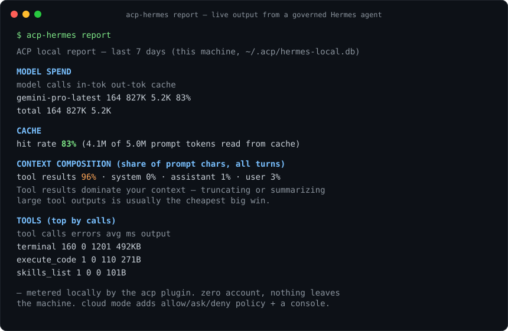

# acp-hermes

**Cost & quality X-ray plus deterministic governance for [Hermes Agent](https://github.com/NousResearch/hermes-agent)** — via the [Agentic Control Plane](https://agenticcontrolplane.com).

[](https://pypi.org/project/acp-hermes/) [](LICENSE) [](https://pypi.org/project/acp-hermes/)

<p align="center"></p>

Two planes, one plugin:

- **Local metering (no account, nothing leaves your machine)** — every model call and tool call your Hermes agent makes is metered into a local SQLite DB. `acp-hermes report` shows spend by model, cache hit rate, what actually fills your context, tool error rates, and cost per task. `report --json` gives agents their own economics so they can self-optimize.
- **Cloud governance (optional, free — `acp-hermes login`)** — every tool call is checked against server-side policy (deny / ask / allow with inline approvals), audited with tenant + session attribution, and visible on a team dashboard across all your machines.

Companion to the [Claude Code ACP plugin](https://github.com/agentic-control-plane/claude-code-acp-plugin). Same backend contract, same dashboard, same policies — wired into Hermes's Python plugin system instead of Claude Code's shell hooks.

Full install guide with dashboard walkthrough: [agenticcontrolplane.com/integrations/hermes](https://agenticcontrolplane.com/integrations/hermes)

## Install

```bash
pip install acp-hermes
hermes plugins enable acp
```

That's it — local metering is on. After your next Hermes session:

```bash
acp-hermes report
```

```
ACP local report — last 7 days (this machine, ~/.acp/hermes-local.db)

MODEL SPEND
  model                    calls   in-tok  out-tok  cache
  gemini-pro-latest          164     827K     5.2K    83%

CACHE  hit rate 83% (4.1M of 5.0M prompt tokens read from cache)

CONTEXT COMPOSITION (share of prompt chars, all turns)
  tool results 96% · system 0% · assistant 1% · user 3%
  Tool results dominate your context — truncating or summarizing large
  tool outputs is usually the cheapest big win.

TOOLS (top by calls)
  tool             calls  errors  avg ms   output
  terminal           160       0    1201    492KB
```

(That's real output from the autonomous agent that runs our own ops backlog — [governed by the same plugin](https://agenticcontrolplane.com/blog/setup-hermes-autonomous-agent-safely).)

Costs come from Hermes's own pricing engine (same numbers Hermes shows you), including OpenRouter and Bedrock routes. Unknown routes are reported as unpriced, never guessed.

To add policies, approvals, and the cross-machine dashboard:

```bash
acp-hermes login
```

`login` opens the dashboard, exchanges your one-time auth token for a workspace API key, and writes it to `~/.acp/credentials`.

On a headless box (SSH, devcontainer, a server with no browser), use the device flow instead — it prints a short code you approve from any browser, phone included, and the key lands on this machine:

```bash
acp-hermes login --device
```

## Configure

For non-interactive setups (CI, devcontainers), skip the `login` step and provide the key directly:

```bash
export ACP_BEARER_TOKEN="gsk_yourslug_..."
# or
mkdir -p ~/.acp && echo "gsk_yourslug_..." > ~/.acp/credentials
```

The env var wins over the file.

Local metering knobs:

```bash
export ACP_LOCAL_METERING=off      # disable local metering entirely
export ACP_LOCAL_DB=/path/to.db    # move the DB (default ~/.acp/hermes-local.db)
```

## CLI

```bash
acp-hermes report            # local cost & quality X-ray (no account needed)
acp-hermes report --days 30  # wider window
acp-hermes report --json     # machine-readable — feed it back to your agent
acp-hermes login             # browser auth + workspace provisioning (cloud plane)
acp-hermes status            # check creds + gateway reachability
acp-hermes logout            # remove ~/.acp/credentials
```

Optional — point at a non-default backend:

```bash
export ACP_API_BASE="https://api.agenticcontrolplane.com"  # default
```

## How it works

The plugin registers four Hermes hooks:

| Hook               | Plane | Behavior                                                   |
|--------------------|-------|------------------------------------------------------------|
| `pre_tool_call`    | cloud | POSTs to `/govern/tool-use`. Server returns `allow` / `deny` / `ask`. `deny` blocks with a system message; `ask` escalates to Hermes's native approval prompt; `allow` passes through. |
| `post_tool_call`   | both  | Records duration, status, and result size locally; POSTs to `/govern/tool-output` for server-side audit, redaction logging, and DLP scanning when logged in. |
| `post_api_request` | local | Records each LLM API request — model, token buckets (input / output / cache read / cache write / reasoning), latency — and prices it with Hermes's own pricing engine. |
| `post_llm_call`    | local | Records context composition by role (system / user / assistant / tool results) per turn. |

Local rows land in `~/.acp/hermes-local.db` (SQLite, WAL). Nothing is uploaded from the metering plane.

### Fail-open

Network errors, timeouts (>4s), malformed responses, a full disk, or a locked SQLite file all **fail open** — the tool call proceeds and (for network issues) a warning is written to stderr. ACP must never block or break your work.

### "Ask" semantic

An ACP `ask` decision escalates to **Hermes's native approval gate** — the same inline `[o]nce / [s]ession / [a]lways / [d]eny` prompt Hermes uses for dangerous shell commands. An `[a]lways` answer is scoped to the tool via the plugin's `rule_key` (`acp:<tool>`), so a standing approval never widens beyond the tool the human actually reviewed. (Versions ≤0.1.0 wrongly claimed Hermes had no approval surface and hard-blocked with a dashboard detour — upgrade.)

### Client identity

Sends `X-GS-Client: hermes-plugin/<version>` so the dashboard, policy router, and audit log can distinguish Hermes traffic from Claude Code / Cursor / Codex / etc.

## Troubleshooting

**`hermes-acp` opens an editor/ACP mode instead of this CLI.** Hermes itself ships a `hermes-acp` binary (ACP there = Agent Client Protocol, its editor integration) — install order decides which one owns the name. This package installs **`acp-hermes`** as the unambiguous primary command (0.2.1+); use that. `python -m acp_hermes.cli` also always works.

**`acp-hermes report` says no metered activity.** The metering hooks only run inside Hermes — confirm the plugin is enabled (`hermes plugins list`, then `hermes plugins enable acp`) and run a session. Also check `ACP_LOCAL_METERING` isn't set to `off`.

**Costs show n/a.** Pricing comes from Hermes's engine in-process; routes it can't price (unusual proxies, self-hosted endpoints) are honestly unpriced. Token counts are still exact.

**No audit events appearing on the dashboard.** Check that `ACP_BEARER_TOKEN` is set in the shell that launched `hermes`, not just your `.zshrc` after the fact. Hermes inherits the env at process start.

**Every tool call blocked.** Look at stderr. A `[ACP] gateway unreachable` warning means network failure (fail-open kicked in but something else blocked you — maybe a policy from another hook). A `[ACP] Denied by policy: …` means the server returned `deny`; check the policy in the ACP dashboard.

## License

MIT
